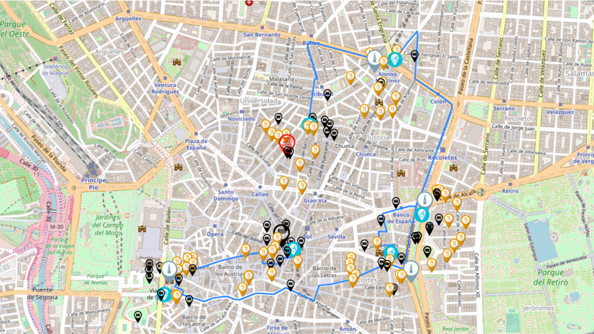

# Monumental BiciMAD Tour Planner

## :rocket: Status
This is the first project for the Madrid Ironhack boot camp.

## :running: One-liner
Create a **personalized tour plan** based on the monuments you want to visit in Madrid. The app generates an **interactive map** with an optimized route between **BiciMAD** bicycle stations, including information on bike availability and nearby points of interest and restaurants.



[Give it a try!](https://tour-planner.fly.dev/)

## :computer: Technology Stack
Hosted on a [fly.io](https://fly.io/) server as a Docker container. The user interface is a Flask web app, with the main script written in Python. Key libraries include requests, pandas, numpy, and folium.

## :boom: Core Technical Concepts and Inspiration
Utilizes Madrid's monuments dataset and BiciMAD's dataset to assist tourists in combining both elements seamlessly.

## :wrench: Configuration
For testing and personal usage, visit the provided [link](https://tour-planner.fly.dev/). To run the script locally, clone the repository, create a virtual environment, install Python, and run `pip install -r requirements.txt` in the project folder.

## :file_folder: Folder Structure

```
└── project
    ├── __wip__
    ├── .venv
    └── data
    │    ├── origin
    │    └── output
    ├── modules
    │   ├── argparser.py
    │   └── dataframe_creation.py
    │   └── email_generator.py
    │   └── main_operations.py
    │   └── map_generator.py
    │   └── route_generator.py
    ├── notebooks
    │   ├── dev_notebook.ipynb
    ├── templates
    ├── .dockerignore
    ├── .env
    ├── .gitignore
    ├── Dockerfile
    ├── install-docker.sh
    ├── LICENSE
    ├── main.py
    ├── README.md
    ├── requirements.txt
    ├── webapp.py
```
## License
[License](LICENSE.txt)